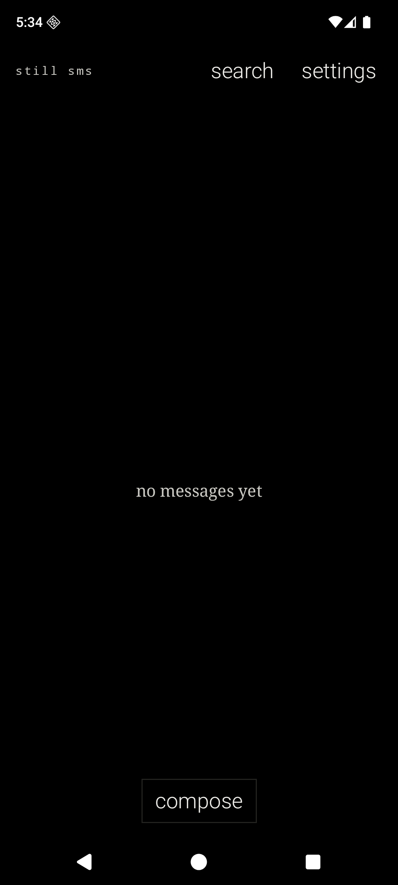
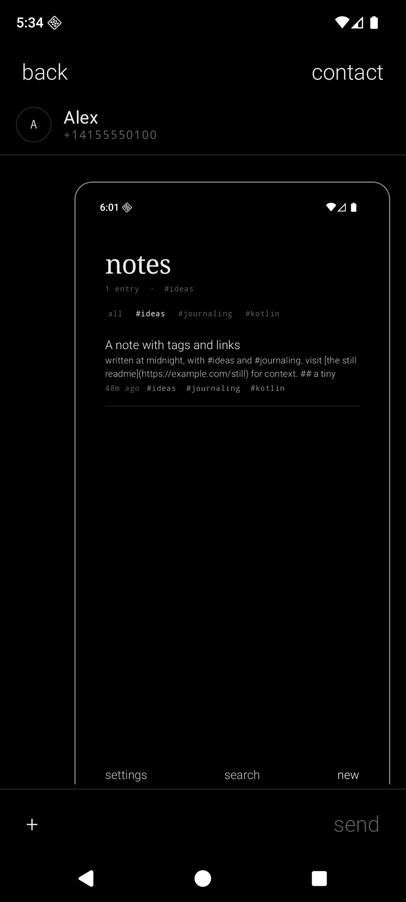
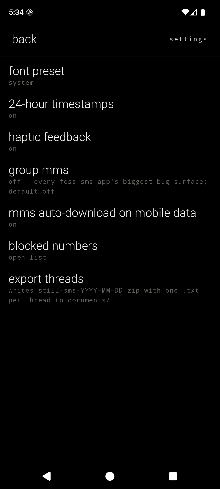
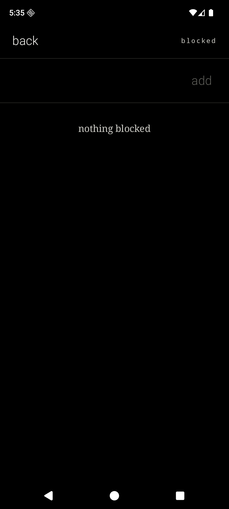

<div align="center">

# Still SMS

#### A monochrome SMS / MMS app that doesn't phone home.

part of the [still](STILL.md) family. the pact governs every line of code in this repo.

<br>

&nbsp;&nbsp;&nbsp;

<br>

</div>

---

Still SMS is a minimalist, privacy-first Android SMS / MMS app. It is monochrome, OLED-first, text-first, and the fifth member of the Still ecosystem after [Still](../still-launcher), [Still Notes](../still-notes), [Still Contacts](../still-contacts), and [Still Clock](../still-clock). Same temperament, same fonts, same refusal to phone home.

It declares no internet permission. It ships no analytics. It depends on neither Firebase nor Google Play Services. The MMS PDU encoder and decoder are hand-written; there is no third-party `smsmms` library. It runs on any Android device from API 26 up, and is designed for [GrapheneOS](https://grapheneos.org).

## What Still SMS does

- A **thread list** as the home screen, sorted newest-first, every conversation in the system mms-sms provider, each row showing the contact display name (or raw number) plus a single-line snippet preview.
- An **inline search** triggered by the `search` verb, regex-aware, matched against sender and body.
- A **`compose` footer verb** that opens the system contact picker and starts a new conversation against the picked number.
- A **thread screen** with iMessage-style bubble grouping — consecutive same-sender messages chain via asymmetric corner radii, one timestamp per group. Hairline border around each bubble; **no fill, no ripple**.
- **Outbound SMS** via `SmsManager.sendTextMessage` / `sendMultipartTextMessage`, with per-part PendingIntents tracking success and failure. Failed rows surface a `· failed` caption.
- **Outbound MMS** (1:1, image + optional caption) via `SmsManager.sendMultimediaMessage`. The M-Send.req PDU is built by a hand-rolled encoder under `mms/MmsPduEncoder.kt`.
- **Inbound SMS** via `SMS_DELIVER`, written directly to `content://sms/inbox` since the default-SMS contract puts that responsibility on us.
- **Inbound MMS** via `WAP_PUSH_DELIVER` → `SmsManager.downloadMultimediaMessage`. The retrieved M-Retrieve.conf is parsed by `MmsPduDecoder.kt` and walked into `content://mms/<id>/part` rows.
- **Live notifications** via a single `messages` channel — heads-up, sender display name, message preview, with a `reply` (RemoteInput) action and a `mark read` action. No "delivered" / "read" surfaces ever, per the pact.
- **Contact name + photo sync** with the system `ContactsContract` provider, so a row stored in [Still Contacts](../still-contacts) (or any other contacts app) renders here as a name and a real photo bubble.
- A **block list** stored as plaintext JSON in `filesDir/blocked.json`; exact-matched against E.164, national, short-code, and alphanumeric sender IDs. SMS is blocked before any provider write; MMS is blocked before placeholder/download and re-checked after retrieve.
- **Long-press** on a thread row → `archive` / `block` / `delete` action sheet. Long-press on a message → `copy` / `forward` / `delete`.
- **Default SMS app role** integration via `RoleManager`. A persistent banner on the thread list explains why the role is required when it isn't held; a `make default sms app` row in settings re-prompts.
- **Plaintext export** to `still-sms-YYYY-MM-DD.zip` via SAF — one `.txt` per thread, named `<display-name-or-number>.txt`, formatted as `YYYY-MM-DD HH:MM  ->  body` (outbound) / `<-  body` (inbound). `cat`-able by design.
- Font presets shared with the rest of the ecosystem: **System**, **Editorial**, **Terminal**, **Grotesk**.

## What Still SMS refuses to do (and what it asks for honestly)

| Refused / asked | Why |
| --- | --- |
| `INTERNET` permission | Refused. The MMS modem-side `MmsService` talks to the carrier; we never open a socket. |
| `READ_PHONE_STATE` permission | Refused. Single-SIM only in 0.4; dual-SIM picker lands in 0.5. |
| `READ_EXTERNAL_STORAGE` / `READ_MEDIA_*` permissions | Refused. Image attachments come through SAF (`GetContent("image/*")`), no broad media scope needed. |
| Firebase, GMS, analytics, AI SDKs, telemetry of any kind | Refused. AndroidX + Compose + DataStore only. |
| Cloud backup, restore, account-add | Refused. The plaintext `.zip` export via SAF is the entire backup story. |
| RCS / Jibe | Refused. Google's RCS APIs are not public to third parties. The About text recommends [Signal](https://signal.org) / [Molly](https://molly.im) for E2EE. |
| Reactions, stickers, GIF picker, emoji panel | Refused. The system keyboard handles emoji. |
| Read receipts, delivery receipts, typing indicators | Refused. SMS doesn't have them natively. The pact bans faking them. Failures are the only signal worth showing. |
| Per-conversation theming / colors / sounds | Refused. Monochrome is monochrome. |
| Group MMS (default) | Refused by default. Behind an explicit settings toggle, default off — it is the single biggest bug surface in every FOSS SMS app. 1:1 first; 0.5 lands the toggle. |
| Scheduled send, snooze, mute-for-N-hours | Refused. The OS notification controls are sufficient. |
| Widgets, app shortcuts, quick-settings tiles, foreground services | Refused. Nothing runs while the app is closed except the default-SMS receivers. |
| **`SEND_SMS`** | **Asked, honestly.** Required to send outbound SMS via `SmsManager.sendTextMessage`. |
| **`READ_SMS`** | **Asked, honestly.** Required to read the system mms-sms provider to render threads. |
| **`RECEIVE_SMS`** | **Asked, honestly.** Required to catch inbound SMS as the default-SMS app. |
| **`RECEIVE_MMS`** + **`RECEIVE_WAP_PUSH`** | **Asked, honestly.** Required to catch inbound MMS notifications as the default-SMS app. |
| **`READ_CONTACTS`** | **Asked, honestly.** Required to resolve numbers to display names + photos via `ContactsContract`. |
| **`POST_NOTIFICATIONS`** | **Asked, honestly.** Android 13+ requires runtime grant to surface new-message notifications. |

None of these involve the network. None pull a third-party SDK.

## Privacy posture, in code

| File | What it guarantees |
| --- | --- |
| `app/src/main/AndroidManifest.xml` | Seven permissions declared (the asks above; `RECEIVE_MMS` and `RECEIVE_WAP_PUSH` are sister-permissions for inbound MMS); no `INTERNET`, no `READ_PHONE_STATE`, no media-scope, no location, no biometrics. Four manifest entries for the default-SMS role: SENDTO activity, SMS_DELIVER + WAP_PUSH_DELIVER receivers, RESPOND_VIA_MESSAGE service. |
| `app/src/main/res/xml/data_extraction_rules.xml` | Excludes every sharedpref / file / database domain from cloud backup and device transfer. |
| `app/build.gradle.kts` | Dependencies only on AndroidX, Compose, and DataStore — no Firebase, no GMS, no analytics SDK, no `smsmms` / Klinker library. |
| `app/src/main/java/dev/chuds/stillsms/mms/` | Hand-rolled M-Send.req encoder + M-Notification.ind / M-Retrieve.conf decoder; no third-party PDU library. Wire format from OMA-WAP-MMS-ENC-V1_3 §7 + OMA-WAP-WSP-V1_0 §8.4. |
| `app/src/main/java/dev/chuds/stillsms/data/BlockListRepository.kt` | Plaintext JSON in `filesDir/blocked.json`. SMS and MMS receiver paths check exact canonical sender keys before provider writes/downloads so blocked senders leave no row, no notification. |
| `app/src/main/java/dev/chuds/stillsms/notif/NewMessageNotifier.kt` | Notification text never contains "delivered", "read", or "seen". `setAllowGeneratedReplies(false)` so no on-device LLM reply suggestions. |

## Architecture

```text
MainActivity
└── StillSmsApp                                  single-Activity Compose shell, hand-rolled router
    ├── ThreadRepository                         ContentResolver bridge for content://sms +
    │                                            content://mms, ContentObserver-backed Flow,
    │                                            archive / delete / mark-read primitives
    ├── ContactNameResolver                      ContactsContract.PhoneLookup → name + photo URI
    ├── BlockListRepository                      plaintext JSON, canonical exact-match keys
    ├── PreferencesRepository                    DataStore — font preset, 24h, haptics, group MMS,
    │                                            MMS auto-download
    ├── ThreadExporter                           one .txt per thread, zip via SAF, cat-able format
    ├── sms
    │   ├── SmsRoleHelper                        RoleManager wrapper
    │   ├── SmsDeliverReceiver                   inbound SMS → block-list filter → provider insert →
    │   │                                        notification
    │   ├── SmsSender                            outbound SMS, sentIntent + deliveredIntent receivers
    │   ├── SmsSentReceiver / SmsDeliveredReceiver  flip MESSAGE_TYPE on result
    │   └── RespondViaMessageService             dialer "decline + reply" hook
    ├── mms
    │   ├── MmsPduEncoder                        M-Send.req binary encoder
    │   ├── MmsPduDecoder                        M-Notification.ind + M-Retrieve.conf parser
    │   ├── MmsSender                            stage PDU → FileProvider → sendMultimediaMessage
    │   ├── MmsSentReceiver                      flip MESSAGE_BOX on send result
    │   ├── MmsDeliverReceiver                   WAP push → downloadMultimediaMessage
    │   └── MmsDownloadReceiver                  parse retrieved PDU, write parts + addr rows
    ├── notif
    │   ├── NewMessageNotifier                   reply (RemoteInput) + mark-read actions
    │   ├── QuickReplyReceiver                   landing pad for inline reply
    │   └── MarkReadReceiver                     flip read=1 on the thread
    └── Compose surfaces
        ├── ThreadListScreen                     list + search + compose footer + default banner
        ├── ThreadScreen                         chat bubbles + composer + attachments
        ├── SettingsScreen                       single-scroll, eight toggles
        ├── BlockListScreen                      add via verb, remove via long-press
        └── ui/components                        StillDivider, StillVerb, StillMenuItem,
                                                 StillInitialDisc, StillActionSheet, ContactPhoto
```

Kotlin, Jetpack Compose, AGP 9.2.1, Gradle Kotlin DSL. The repository owns every `ContentResolver` call; the Compose layer never touches a cursor. The router is a hand-rolled `sealed interface Route { ... }` — no `androidx.navigation`. Content observers feed `callbackFlow` with debounced re-queries; one-shot `fetchThreads()` / `fetchMessages()` for the exporter.

## Gestures

| Gesture | Effect |
| --- | --- |
| Tap a thread row | Open thread |
| Long-press a thread row | Action sheet — `archive` / `block` / `delete` |
| Tap `compose` | Open contact picker, start a new thread |
| Tap `search` | Reveal inline regex filter against sender + body |
| Tap `+` in the composer | SAF image picker → 1:1 MMS with the current draft as caption |
| Tap `send` | Outbound SMS (or multipart SMS for >160 chars) |
| Long-press a message | Action sheet — `copy` / `forward` / `delete` |
| Tap `contact` in the thread header | `ACTION_VIEW` on `tel:<number>` (opens Still Contacts or system) |
| Tap `back` | One step back along the route stack |
| Reply from notification | RemoteInput → `SmsSender.send` directly, no activity launch |

## Design language

- OLED black background. Soft white primary text. Gray secondary text. Hairline (`#232320`) dividers and bubble borders.
- Serif for thread titles and the bubble body. Sans-serif for chrome. Monospace for kickers, captions, timestamps, the `still sms` brand mark, and the export format.
- Lowercase for verbs (`send`, `compose`, `search`, `settings`, `back`, `contact`, `copy`, `forward`, `delete`, `archive`, `block`, `add`, `remove`, `make default sms app`, `export threads`, `mark read`, `reply`). Title case only for things the user typed.
- Bubbles have an asymmetric "tail" toward the sender and chain via squared inner corners when consecutive. **No fill** anywhere — the hairline border is the entire visual.
- No ripple. 60ms opacity fade only. No bouncy motion, no colorful accents.

## MMS, honestly

Outbound MMS is **emulator-untestable** because the emulator has no carrier APN configured — `SmsManager.sendMultimediaMessage` is accepted by `MmsServiceBroker` but the modem-side handshake never completes. The codepath is verified in this repo through:

- The hand-rolled M-Send.req PDU encoder produces a wire-format payload (typically 80–150 KB for a screenshot-sized image).
- The PDU is staged in `cacheDir/mms_outbox/` and exposed via FileProvider to `com.android.phone` / `com.android.mms.service`.
- `MmsServiceBroker: sendMessage() by dev.chuds.stillsms` confirms the system accepts our handoff.
- `MmsSentReceiver` flips the `MESSAGE_BOX` on the broadcast result.

The carrier gauntlet (Verizon, T-Mobile, AT&T, Mint US, plus GiffGaff UK and Vodafone DE) is the **1.0 gate** — not a 0.4 promise. If you flash 0.4 onto a SIMmed device and your carrier rejects the PDU, please open an issue with the carrier's `MMS_ERROR_*` code; the carrier-quirks fallback path will land in `docs/mms-quirks.md`.

Inbound MMS is similarly emulator-untestable (no WAP push without a carrier). `MmsDeliverReceiver` parses the notification, calls `downloadMultimediaMessage`, and `MmsDownloadReceiver` walks the resulting PDU into the provider.

## Build and install

Requirements: **JDK 17**, the **Android SDK** with `platforms;android-36` and `build-tools;36.0.0`. The Gradle wrapper (9.4.1) is bundled.

```bash
JAVA_HOME=$(/usr/libexec/java_home -v 17) ./gradlew :app:assembleDebug
adb install -r app/build/outputs/apk/debug/app-debug.apk
```

The app appears as **still sms** in the launcher. On first launch, tap `make default` in the banner to grant the SMS role; without it, the system delivers no inbound messages and the provider holds no rows for us to render.

## Notes for GrapheneOS

Still SMS depends on no part of Google Play Services and declares only the seven SMS / MMS / contacts / notifications permissions listed above, so it runs cleanly on a fresh GrapheneOS profile. The default-SMS role grants both read and write to `content://sms` and `content://mms` without additional runtime permissions. `RECEIVE_WAP_PUSH` is required for the WAP_PUSH_DELIVER intent filter the role gauntlet enforces.

## Status

Pre-1.0. Builds against AGP 9.2.1 / Kotlin 2.3.21 / `compileSdk 36`. Verified via `./gradlew assembleDebug`, install, and emulator interaction:

- 0.1 — read-only thread list + thread view, default-SMS role manifest.
- 0.2 — outbound SMS + RemoteInput notification reply + SENDTO activity routing.
- 0.2.1 — chat-bubble thread view, navigation-bar inset fix, contact name + photo sync.
- 0.3 — outbound + inbound 1:1 MMS scaffolding (emulator-verified up to handoff; carrier gauntlet is the 1.0 gate).
- 0.3.1 — critical MMS fixes (file_paths inbox root, msg_box direction, Quoted-string Content-IDs, decoder text-string parsing) + bubble image render.
- **0.4 — settings, block list, plaintext export, long-press action sheets, README. ← you are here**.

Roadmap: 0.5 = group MMS (behind toggle) + dual-SIM picker. 1.0 = carrier gauntlet pass on the four major US carriers + two EU.

## License

MIT. See [`LICENSE`](LICENSE).
